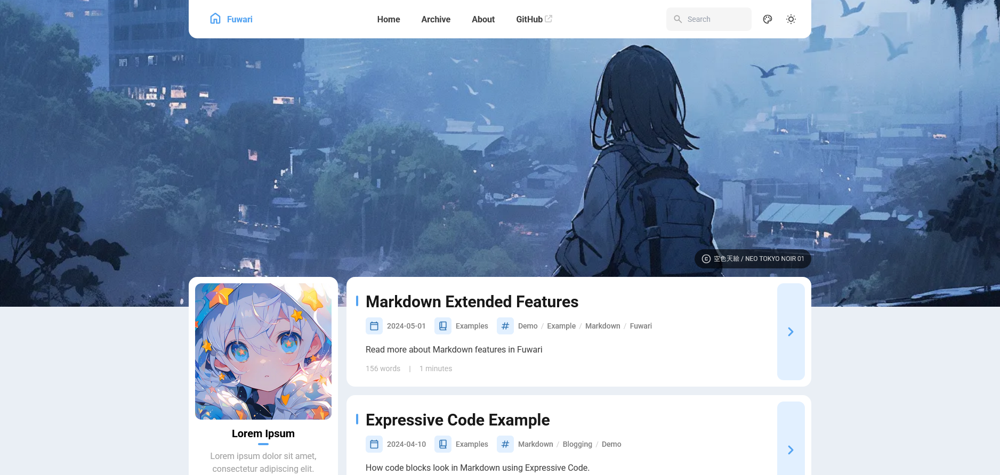

---

title: Hello!AME-TREC2.0
published: 2025-07-24
image: ./logo.png
tags: [blog]
category: blog
draft: false

---
# 1.サイトを移転した。名前も変えた。
今まであったサイトがなにか気に入らなかったので、移転しました。  
同じGoogleサイトでやることも考えましたが、今回は[Astro](https://astro.build/)というフレームワークを使って作りました。   

なかなかいい感じです。また、Fuwariというテンプレートを使っているのですが、これがまたデザインがいい！  
カスタマイズの柔軟性があまりないのが玉に瑕ですが、それに目を瞑れば素晴らしいテンプレートです。
やはり個人HPっていいですね。  

fuwariのデモページ。かわいい。

# 2.国際放送が面白い
最近短波ラジオというものを買いました。  
どうやら海外の日本語放送も聞けるそうなので、試しに中国、韓国、台湾の国際放送を聞いてみました。  

内容としてはコミュニティラジオみたいな感じ。特に韓国のものは生活感がたっぷりで面白いです。  
また、北朝鮮の国際放送も日本で受信できるらしいですが、怖くて聞けません。    

どんな内容なんだろう…    

