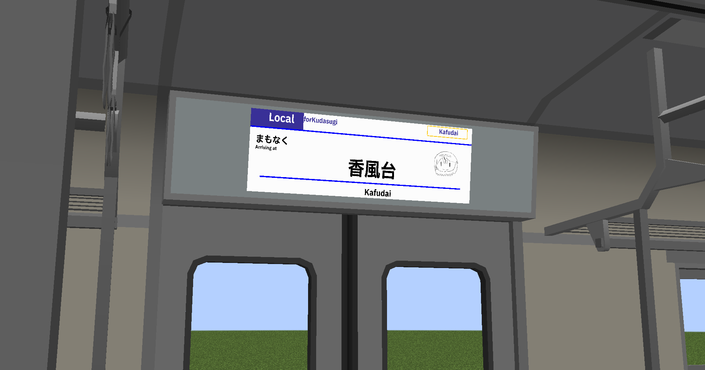

---

title: マイクラで電車のLCDを作った（modだけど）
published: 2025-07-31
image: zakki2.png
tags: [blog]
category: blog
draft: false

---
# 1.マイクラで電車のLCDと方向幕を作った。
私はマイクラのMTRというmodが大変お気に入りでして、そのアドオンであるANTEというmodで電車のLCDが作れるというので、作ってみました。  
はっきり言って**めっっっっっっっっっっちゃ難しかった**です。  
ここでは詳しく作り方は説明しませんが、[ぼたもち様の記事](https://botamochi-129.hatenablog.com/entry/2025/01/21/180000)が大変参考になります。よかったらどうぞ。  
また、MTR関連のDiscordサーバーなどで聞くのも手。

ぼたもち様、ねすと様、本当にありがとうございました！  

# 2.動画を作れてない
ここ最近、というか今年に入ってから動画を作れてない気がします。  
半分失踪気味です。これはひどい。  
なんとかして動画の作り方を思い出さないとまずいので、いい加減作ろうと思います。対戦よろしくお願いします。  
（でもそういってまた作らない気もするんだよなぁ…）  